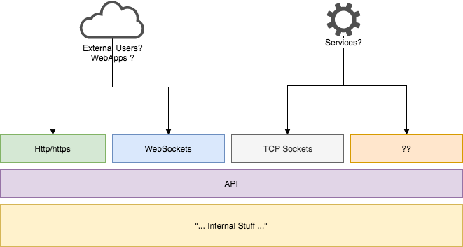

# “TARAPI” An API Rant! 

I have to call it something… we always do!

Yeah Yeah it stands for "The-Anti-Rest-API"    
Lost 50% of readers right there... 45% will complain... 10% will give this some thought!    
Wait, what? 105%? Ohh 5% will complain without reading... right!    

Disclaimer: I will use a lot of "**you** do this... **you** did that..."    
It is deliberate because i want to strike a nerve, to feel personal, uncomfortable even.    
However it is not, and never was, meant to be offensive.    
I have done some of the things that i complain here, so i'm not excluding myself from it.    

Let me put it out there, I think any REST API is crap.    
Sure… this will ruffle some feathers!    
Its just something that became popular and spread like wildfire.    

At some point, someone proposed this new way to build an API, one that “_took advantage_” of the underlying structure of the http protocol.    
People liked it without question the biggest mistake in this assumption:    
“Why is the protocol being used to indicate what must be done or has been done? Just because http works that way? Is it reason enough?”

It is bad for one main reason: **It conflates transport with execution**   
There are plenty to dislike about REST APIs but they all have the same root.

This promiscuity between transport and execution was created without thinking that an API could and should be build in a way that allow its use over multiple different transport methods, however, REST API relies on the use of Http Status codes, Verbs, and Urls… none of them can be replicated in other transports.

With a REST API you are locked not being able to use it over web sockets for instance.   
What about TCP sockets… good old sockets?   
Message queue systems (MQTT)?   
Or… even with File Systems? (sure i would not do it either!)   
Homing Pigeons?   

The point is that an API is a method of transferring information and executing commands, preferably using any method of transportation that we have available. On the other hand a REST API allows for only one way of transferring the data.

 

Authentication is outside of the scope of this rant as it pertains to the transport and would need to be handled differently in all of them.   
The API layer itself would not do authentication.


Lets take it one step at a time, starting by the logical last one... the response:

### Http Status Codes

Do the codes mean anything? No, they do not. The same code can be used by the API or the server to indicate massively different things. We must almost always look at the payload to see what was done.

From somewere on the interwebs...   
_“A 403 error response indicates that the client’s request is formed correctly, but the REST API refuses to honor it i.e. the user does not have the necessary permissions for the resource.”_

Notice the error in the assumtion: _"request is formed correctly but the REST API refuses to honor it "_!    
No, sorry, no. When you get a 403 form any API you can not assume this, ever.   
The request may not have gotten to the API.   

How do i know the difference between that and the SysAdmin messing up and removing all access to the API? Do I have to go and look at the payload? See if its valid?     
Yes? Why the hell do we need the status codes for then?   


And don’t get me started on the 500… be honest, how many times did you see APIs responding with a 500 to indicate something went wrong with the stuff you sent?

Some times you get a 500 and you have to go and see the payload to get what happened, but some times you get a 500 because the server craped itself and there is not even a valid payload.    
Its nonsense, all of it.

Oh... and what about the mixed response where some responses come in html or plain text instead of valid json payloads?   
Well, yes you can say that is a bad implementation. Granted, but that exists only because transport/protocol and execution got mixed.
Remove the assumption that there is an http protocol available and the html responses will most probable go away too.

We should not use status codes at all as those indicate the status of the transport and not the execution.

When using http/https it should be like this:

200 = All requests got to the API… ALL OF THEM no matter what happened inside the API. You want so say that the user has no access to the resource? Do it in the response payload!

Anything else… its just the protocol talking not the API   
Anything else and you would not be required to look at the payload because you knew from the start that it was not the API responding.

401 = API needs authentication (outside of the scope of this rant)   
500 = “Crap the server is not good”   
403 = “Someone messed up”   
429 = “Hold your horses”   

None of this has to do with the Execution and should not be treated the same way.   
If we try to use the same _"TARAPI"_ with any other transport it would still work.   

TCP/Sockets:

- Client open connection   
- Provides authentication according to whatever was specified for that transport   
- If accepted, it starts sending payloads and receiving payloads… no status codes, no verbs, no urls.

Files (huum, its just an example):

- Provides authentication according to whatever was specified for that transport   
- Client saves a file with a payload on a folder accessible to both the server and client (nfs, smb, ftp, ssh… go wild, it just an example)   
- Server gets the file, writes a file with response   
- Clients reads response files from folder   

Pigeons:

- Client prints payload on paper   
- Monkey attaches payload to pigeon leg   
- Monkey gets payload from pigeon leg... OCR's it   
- ...   

... the point is: Why build an API that has no versatility at all by locking it to the http protocol?   

While we are in the topic of responses, make them consistent.   
Make the response always the same format even if coming from different places in the API.   
Even if you need to do things asynchronously, CallBacks, AsyncCalls, WebHooks, whatever you want to call them.   

Example: (and only that)   
```
{
	"ResponseFrom": "MethodSomething",
	"Status": "OK", //or NOK codes 
	"Errors": [ ... ], //Describing catastrophic errors
	"Warnings": [ ... ], //Something to pay attention to but not catastrophic
	"Info": [ { "All fine skipper!" } ], 
	"Payload": 
	{
		"ObjectID": "123456",
		...
	}
}
```

Think of responses in a _parsable_ way. They will most definitely not be read by a Human so they need to be consistent.   
Now, the payload would obviously be different from method to method, but anything outside of the _Payload_ json node should be the same between all methods.

Consistency will even allow you to have some users working assyncronasly and some users, perhaps less technically proficient, working synchronously by sacrificing performance. All you need is a user setting or who knows the user could request sync or async when doing the request. (Assuming the inner workings of the API allow for it) This gives you versatility.

### Verbs and URLs

This is just more of the same, mixing transport with execution.  
Just do it all with the payload.  
If you do, it will allow anything of the above, and you gain a few things even if you use it in http.  

In REST, We need payload + Url + verb.  
If you want to "save" the operation you need to save all of the above ans sync them.
 
In TARAPI... the payload itself describes all of the operation instead of only part of it.  
Logging becomes simpler, and if needed, your internal tools can even reprocess those payloads later (redo actions, solve problems, run them in Dev) because they are complete, all the information is there.

### IDs

For the love of God don’t force your clients/users to keep record of your internal Ids!   
The API should work with the ID of the original object.   
Now its fine (read much better) for your internal system to use internal ids, but have the API match object using the client own IDs... not yours.

Lets see, there is mainly 3 types of APIs:   
1 - Clients create objects on the API system and deal only with those remote objects   
2 - Clients create objects on their own system and then sync them to the API   
3 - Hybrids, where the client can do both.   

Most APIs I have worked with are of the 2 and 3 type, but they always force the client to keep a record of the remote API id? Why?

Don’t you like to sleep well at night?   
So, instead of solving the problem on your side _ONCE_, you force each and _EVERY_ client to solve the same problem over and over and over again on there side?   
This will without a doubt be a source of problems, bad implementations, errors, support tickets… and ultimately management steaming from the ears like a cartoon character!


If a client needs to send his objects to multiple APIs, he will have to create a way to keep a record of multiple API ids for that same object. A 1-to-N table is the most common.

If you on the other hand keep that record, you only need a simple extra column on the object table named _ExternalObjectID_. **Nothing more**.

“Hei what about conflict?” you ask

ClientA has an Object with ID 1   
ClientB has an Object with ID 1

So what, you identify the object by ClientID+ExternalObjectID right? Where is the problem?   
The ClientID you already know from the authentication process, the ExternalObjectID is sent to you on the request payload.

Example 1:

- ClientA creates an Object on his own system with ID “1”   
- ClientA send you a request where it asks the API to save Object "1" into your DB   
- You save it and reply with a payload containing the status of the operation Object "1" that lives in your DB identified with "1" in the column ExternalObjectID.

Even if the API works asynchronously, the payload is the same.

Example 2:

- ClientA send you a request where it asks the API to save Object but sends no ID   
- You save it and reply with a payload containing the status of the operation and your own ID. (you can just use your primary key if you want, but copy it to the ExternalObjectID column)

If you don’t want to support clients creating object directly in you system you can just reject payloads without and ID. Thats it. And you can even control this on a by client basis.   
Some clients can, some can’t.   

No matter the case your API can work the same way and support both scenarios.   
It comes at no cost at all when compared with the problems you can avoid by eliminating the need for ALL your clients to keep a record of your IDs.

- You simplify their implementation. That is a big one even if you want to ignore it.

- If the clients looses that record, he can just resend the Objects again and no duplicates will be created on your side.

- If they can get a list of items from the API, they can easyly check if there is anything in there that should not be (by checking their ID) and delete it.

Look, like it or not we are in the business of “support ticket elimination/prevention”.   
And I am sure that solving the problem of the ExternalObjectID once on the API side is far better than forcing your clients, all of them, to do it.
Help your users, don't force them to keep you IDs. They may not have a way to do it.   
Do you want to loose users just because you don't want a extra column to hold their ID on your DB?

This will help to eliminate another source of problems, related to the previous topic... Verbs  
No more need to PUT vs POST verbs.
Its all a POST:
- If you already have the Object, Update
- If you do not have the Object: Insert


### Content manipulation

While we are in the topic of taking work from your users.   
Anything you feel is particular to you... you should do it! Period. Sorry.   
Before you feel like forcing your users to do something, ask if any of your competitours have no such requisite.

Example:   
Why ask that all users remove \r\n from texts (!?) and send "BR" instead?   
Do it on the API!   
Well, this is a deeper problem...   
I personaly think that saving "BR" in your database on a piece of text that is not Html is just dumb!    

### Summary

What does the user want to do?   
What is the minimum necessary for the user to do what he wants?   
(usually: AUTH, LIST, GET, POST, DELETE)   

Everything else: Optional!   
Everything else: Is your job to deal with it!   

(I'm sure this rant is not over)

## In case you are feeling generous somehow...
[](https://www.paypal.me/maxsnts)


